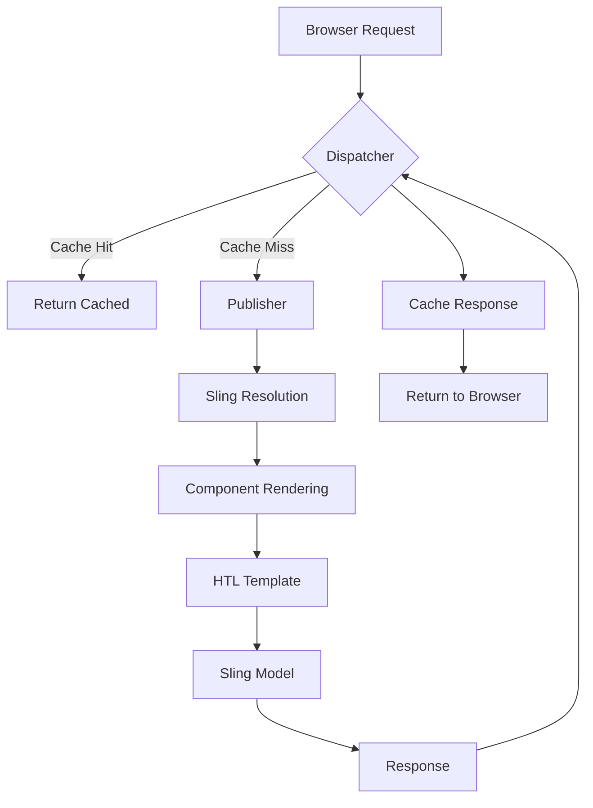
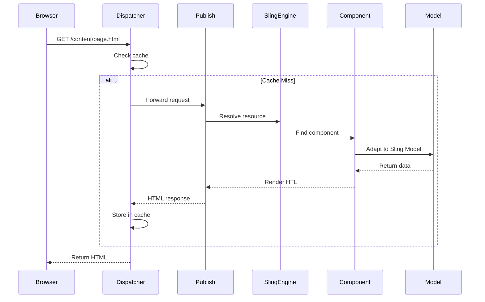
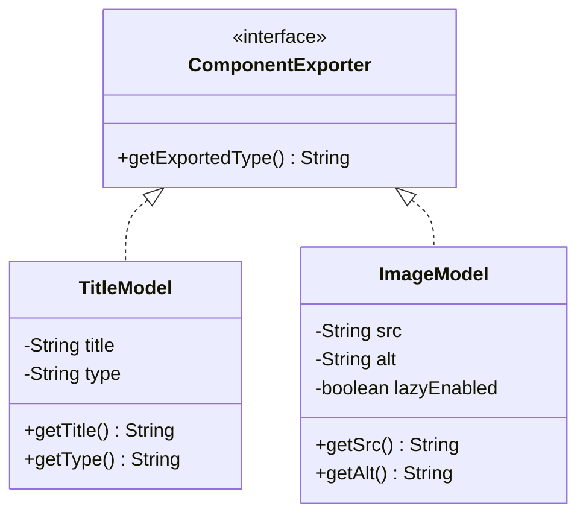
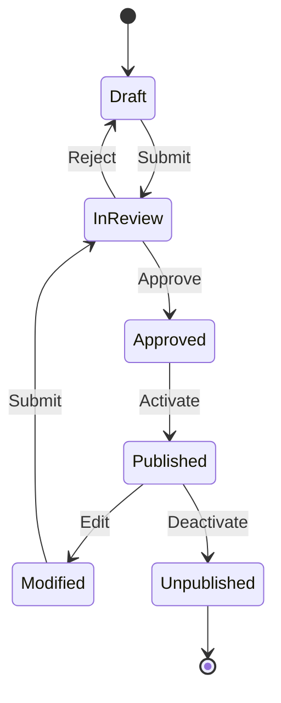
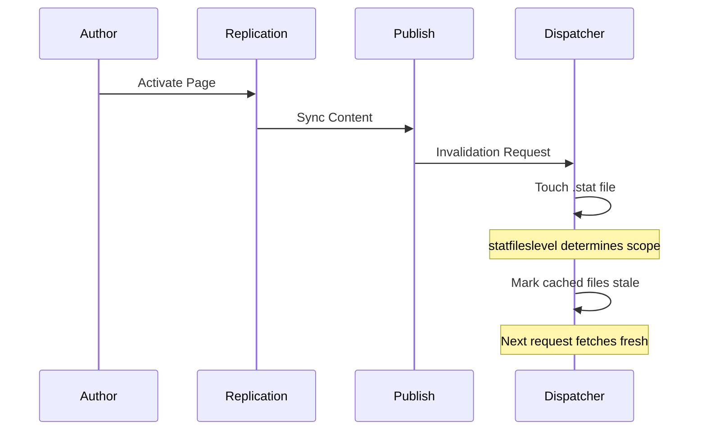
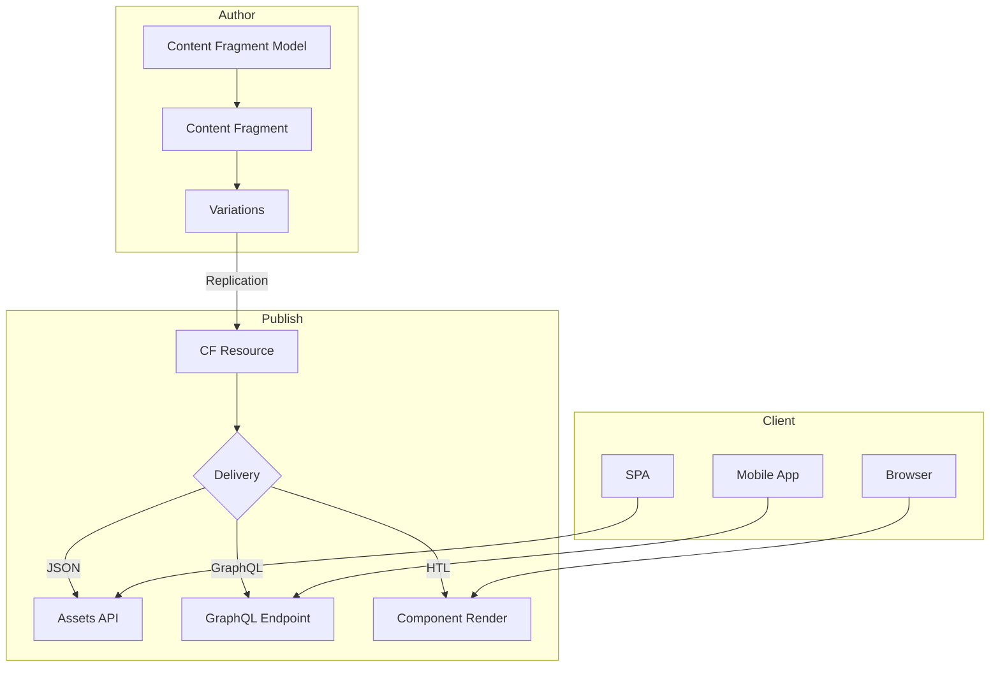

# AEM Architecture Diagrams Workflow

**Create technical diagrams for AEM architecture using Mermaid and ASCII art.**

---

## Purpose

This workflow enables creating visual representations of AEM architectures, component structures, request flows, and system designs. Use when the user requests:
- Architecture diagrams
- Component structure visualization
- Request/response flow diagrams
- Caching flow diagrams
- OSGi service dependency graphs
- Sling Model relationships
- Dispatcher configuration visualization
- Content hierarchy diagrams

---

## Diagram Types

### 1. Mermaid Diagrams

For interactive, render-able diagrams that can be embedded in documentation.

#### Flowcharts (Request/Response Flows)


#### Sequence Diagrams (Component Rendering)


#### Class Diagrams (Sling Model Relationships)


#### State Diagrams (Content Lifecycle)


---

### 2. ASCII Art Diagrams

For inline documentation, comments, and text-only environments.

#### Component Structure
```
/apps/myproject/components/contenthub/
├── .content.xml                    # Component definition
├── _cq_dialog/
│   └── .content.xml                # Dialog with 4 tabs
├── _cq_design_dialog/
│   └── .content.xml                # Style system dialog
├── _cq_editConfig.xml              # Edit bar config
├── _cq_template/
│   └── .content.xml                # Default values
├── contenthub.html                 # Main HTL
├── templates/
│   └── card.html                   # Card template
└── clientlib/
    ├── .content.xml
    ├── css.txt
    ├── js.txt
    ├── css/
    │   └── contenthub.css
    └── js/
        └── contenthub.js
```

#### Architecture Layer Diagram
```
┌─────────────────────────────────────────────────────────────────────────┐
│                              PRESENTATION                                │
│  ┌─────────────────┐  ┌─────────────────┐  ┌─────────────────────────┐  │
│  │   HTL Template  │  │   ClientLibs    │  │    Author Dialog        │  │
│  │   (contenthub)  │  │   (JS + CSS)    │  │    (4 Tabs)            │  │
│  └────────┬────────┘  └────────┬────────┘  └────────────────────────┘  │
├───────────┼────────────────────┼────────────────────────────────────────┤
│           │                    │                     MODEL               │
│  ┌────────▼────────────────────▼────────────────────────────────────┐  │
│  │                     ContentHubModel (Sling Model)                 │  │
│  │  - @OSGiService, @ChildResource, @ValueMapValue injections       │  │
│  │  - Sling Model Exporter for JSON API                             │  │
│  └────────┬─────────────────────────────────────────────────────────┘  │
├───────────┼─────────────────────────────────────────────────────────────┤
│           │                    SERVICE LAYER                             │
│  ┌────────▼─────────────────────────────────────────────────────────┐  │
│  │  ┌─────────────────┐  ┌────────────────┐  ┌──────────────────┐   │  │
│  │  │  Aggregation    │  │ Personalization │  │   Cache Service  │   │  │
│  │  │   Service       │  │    Service      │  │                  │   │  │
│  │  └────────┬────────┘  └───────┬────────┘  └────────┬─────────┘   │  │
│  └───────────┼───────────────────┼───────────────────┼──────────────┘  │
├──────────────┼───────────────────┼───────────────────┼──────────────────┤
│              │                   │                   │     CONTENT       │
│  ┌───────────▼───────────────────▼───────────────────▼──────────────┐  │
│  │  [Pages] [Tags] [Query] [Fragments] [Assets] [External API]      │  │
│  └──────────────────────────────────────────────────────────────────┘  │
└─────────────────────────────────────────────────────────────────────────┘
```

#### Request Flow (Dispatcher Caching)
```
                                    ┌─────────────┐
                                    │   Browser   │
                                    └──────┬──────┘
                                           │
                                           ▼
┌──────────────────────────────────────────────────────────────────────────┐
│                                    CDN                                    │
│  ┌─────────────────────────────────────────────────────────────────────┐ │
│  │ TTL Check → Cache Hit? → [YES] → Return Cached                      │ │
│  │                  ↓                                                   │ │
│  │                [NO]                                                  │ │
│  └─────────────────┬───────────────────────────────────────────────────┘ │
└────────────────────┼─────────────────────────────────────────────────────┘
                     ▼
┌──────────────────────────────────────────────────────────────────────────┐
│                              DISPATCHER                                   │
│  ┌─────────────────────────────────────────────────────────────────────┐ │
│  │ /filter → /cache → statfileslevel → /invalidate                     │ │
│  │     │         │           │              │                          │ │
│  │     ▼         ▼           ▼              ▼                          │ │
│  │  [DENY]    [.stat]    [/content]    [/dispatcher]                   │ │
│  │  [ALLOW]   [TTL]      [/site]       [/invalidate]                   │ │
│  └─────────────────┬───────────────────────────────────────────────────┘ │
└────────────────────┼─────────────────────────────────────────────────────┘
                     ▼
┌──────────────────────────────────────────────────────────────────────────┐
│                              PUBLISHER                                    │
│  ┌────────────────┐  ┌─────────────────┐  ┌─────────────────────────┐   │
│  │ Sling Engine   │→ │ Resource        │→ │ Servlet/Script          │   │
│  │ (Resolution)   │  │ (JCR Node)      │  │ (HTL + Model)           │   │
│  └────────────────┘  └─────────────────┘  └─────────────────────────┘   │
└──────────────────────────────────────────────────────────────────────────┘
```

#### OSGi Service Dependencies
```
┌─────────────────────────────────────────────────────────────────────────┐
│                         ContentHubModel                                  │
│  ┌──────────────────────────────────────────────────────────────────┐   │
│  │ @OSGiService ContentAggregationService aggregationService        │   │
│  │ @OSGiService PersonalizationService personalizationService       │   │
│  │ @OSGiService CacheService cacheService                           │   │
│  └──────────────────────────────────────────────────────────────────┘   │
└─────────┬───────────────────┬────────────────────────┬──────────────────┘
          │                   │                        │
          ▼                   ▼                        ▼
┌─────────────────┐  ┌─────────────────┐     ┌─────────────────┐
│ ContentAggrega- │  │ Personalization │     │  CacheService   │
│ tionService     │  │ Service         │     │                 │
├─────────────────┤  ├─────────────────┤     ├─────────────────┤
│ @Reference      │  │ @Reference      │     │ @Activate       │
│ CacheService    │  │ SegmentResolver │     │ Config config   │
│                 │  │                 │     │                 │
│ @Reference      │  │ @Reference      │     │ @Modified       │
│ QueryBuilder    │  │ UserManager     │     │ void modified() │
└────────┬────────┘  └────────┬────────┘     └─────────────────┘
         │                    │
         ▼                    ▼
  ┌──────────────┐    ┌──────────────┐
  │ QueryBuilder │    │SegmentResolver│
  │ (AEM API)    │    │ (AEM API)    │
  └──────────────┘    └──────────────┘
```

#### Sling Jobs Flow
```
┌─────────────────────────────────────────────────────────────────────────┐
│                          Sling Jobs Architecture                         │
├─────────────────────────────────────────────────────────────────────────┤
│                                                                          │
│   ┌────────────────────┐                                                │
│   │    JobManager      │                                                │
│   │  createJob(topic)  │                                                │
│   │  .properties(...)  │                                                │
│   │  .schedule()       │                                                │
│   │  .cron("0 0 * *")  │                                                │
│   │  .add()            │                                                │
│   └─────────┬──────────┘                                                │
│             │                                                            │
│             ▼                                                            │
│   ┌─────────────────────────────────────────────────────────────┐       │
│   │                       Job Queue                              │       │
│   │  ┌─────┐ ┌─────┐ ┌─────┐ ┌─────┐ ┌─────┐                    │       │
│   │  │Job 1│ │Job 2│ │Job 3│ │Job 4│ │Job 5│  ...               │       │
│   │  └──┬──┘ └──┬──┘ └──┬──┘ └──┬──┘ └──┬──┘                    │       │
│   └─────┼───────┼───────┼───────┼───────┼───────────────────────┘       │
│         │       │       │       │       │                                │
│         ▼       ▼       ▼       ▼       ▼                                │
│   ┌─────────────────────────────────────────────────────────────┐       │
│   │                    JobConsumer                               │       │
│   │  @Component(property = {                                     │       │
│   │      JobConsumer.PROPERTY_TOPICS + "=my/job/topic"          │       │
│   │  })                                                          │       │
│   │  public JobResult process(Job job) {                         │       │
│   │      // Process on ONE instance only                         │       │
│   │      return JobResult.OK | FAILED | CANCEL;                  │       │
│   │  }                                                           │       │
│   └─────────────────────────────────────────────────────────────┘       │
│                                                                          │
│   ┌─────────────────────────────────────────────────────────────┐       │
│   │                    Job States                                │       │
│   │  QUEUED → ACTIVE → SUCCEEDED                                 │       │
│   │                  ↘ STOPPED / ERROR / GIVEN_UP                │       │
│   └─────────────────────────────────────────────────────────────┘       │
│                                                                          │
└─────────────────────────────────────────────────────────────────────────┘
```

---

## Workflow Steps

### Step 1: Identify Diagram Type

Based on the request, select the appropriate diagram type:

| Request Type | Diagram Type | Format |
|--------------|--------------|--------|
| Request/response flow | Flowchart or Sequence | Mermaid |
| Component structure | Tree | ASCII |
| Layer architecture | Box diagram | ASCII |
| Service dependencies | Class or flowchart | Mermaid |
| Content lifecycle | State diagram | Mermaid |
| Cache flow | Flowchart | Mermaid/ASCII |
| OSGi component graph | Class diagram | Mermaid |
| Deployment architecture | Box diagram | ASCII |

### Step 2: Gather Context

For AEM diagrams, identify:
- **Scope**: Component, page, site, or system level
- **Environment**: Author, Publish, Dispatcher, CDN
- **Layer**: Presentation, Model, Service, Repository
- **Integration points**: External APIs, DAM, Content Fragments

### Step 3: Create Diagram

Use the templates above as starting points. Customize with:
- Actual component names
- Real service classes
- Specific paths and configurations
- Project-specific patterns

### Step 4: Add Annotations

Include helpful annotations:
- Performance notes
- Caching behavior
- Security considerations
- Cloud Service compatibility notes

---

## AEM-Specific Diagram Templates

### Template: Component Rendering Flow
```mermaid
flowchart LR
    A[Request] --> B[Sling Resolution]
    B --> C{Resource Type}
    C -->|apps/project/comp| D[HTL Template]
    D --> E[data-sly-use.model]
    E --> F[Sling Model]
    F --> G{Injection}
    G -->|@ValueMapValue| H[JCR Property]
    G -->|@OSGiService| I[OSGi Service]
    G -->|@ChildResource| J[Child Node]
    H & I & J --> K[Model Data]
    K --> L[HTL Render]
    L --> M[HTML Output]
```

### Template: Dispatcher Cache Invalidation


### Template: OSGi Configuration Flow
```mermaid
flowchart TD
    A[OSGi Config] --> B{Config Location}
    B -->|/apps/.../config| C[All Environments]
    B -->|/apps/.../config.author| D[Author Only]
    B -->|/apps/.../config.publish| E[Publish Only]
    B -->|/apps/.../config.dev| F[Dev Runmode]
    B -->|/apps/.../config.stage| G[Stage Runmode]
    B -->|/apps/.../config.prod| H[Prod Runmode]

    C & D & E & F & G & H --> I[ConfigurationAdmin]
    I --> J[@Activate Config config]
    J --> K[Service Initialized]
```

### Template: Content Fragment Delivery


---

## Usage Examples

### Example 1: User asks for component architecture diagram
```
User: "Show me the architecture of a content hub component"

Response: Create ASCII art showing:
- Component file structure
- Layer diagram (Presentation → Model → Service → Content)
- Service dependencies
```

### Example 2: User asks for request flow
```
User: "Diagram the request flow from browser to AEM through Dispatcher"

Response: Create Mermaid sequence diagram showing:
- Browser → CDN → Dispatcher → Publisher → Response path
- Cache hit/miss decision points
- Invalidation flow
```

### Example 3: User asks for service dependencies
```
User: "Show the OSGi service dependencies for our aggregation service"

Response: Create Mermaid class diagram showing:
- Service interfaces and implementations
- @Reference dependencies
- Cardinality and policies
```

---

## Integration with Art Skill

For high-quality visual diagrams (PNG/SVG), you can combine this workflow with the Art skill:

1. Create Mermaid diagram structure using this workflow
2. Use Art skill's TechnicalDiagrams workflow for styled output
3. Apply AEM-specific styling (Adobe colors, icons)

### Adobe AEM Color Palette
```
Primary Red:     #EB1000 (Adobe Red)
Secondary Gray:  #4B4B4B
Background:      #F5F5F5
Accent Blue:     #1473E6 (Adobe Blue)
Success Green:   #2D9D78
Warning Orange:  #E68619
```

---

## Best Practices

1. **Keep diagrams focused** - One concept per diagram
2. **Use consistent notation** - Same shapes mean same things
3. **Add legends when needed** - Explain non-obvious symbols
4. **Include version/date** - For documentation purposes
5. **Link to code** - Reference actual file paths when possible
6. **Consider audience** - Technical depth varies by reader
7. **Update with changes** - Diagrams become documentation debt

---

## Quick Reference

### Mermaid Syntax Cheat Sheet
```
# Flowchart
flowchart TD|LR|TB|BT
    A[Rectangle] --> B{Diamond}
    B -->|Yes| C((Circle))
    B -->|No| D[(Database)]

# Sequence
sequenceDiagram
    participant A
    A->>B: Sync message
    A-->>B: Async message
    Note over A,B: Note text

# Class
classDiagram
    class Name {
        +publicMethod()
        -privateField
    }
    Parent <|-- Child : extends

# State
stateDiagram-v2
    [*] --> State1
    State1 --> State2 : event
    State2 --> [*]
```

### ASCII Box Drawing Characters
```
Box corners:  ┌ ┐ └ ┘
Lines:        ─ │ ├ ┤ ┬ ┴ ┼
Arrows:       → ← ↑ ↓ ↔ ↕
Double:       ═ ║ ╔ ╗ ╚ ╝
Rounded:      ╭ ╮ ╰ ╯
```
