# AEM Diagram Patterns

Reusable diagram templates for AEM architecture documentation.

---

## Table of Contents

1. [When to Use Each Format](#when-to-use-each-format)
2. [C4 Model Diagrams](#c4-model-diagrams)
3. [Flow Diagrams](#flow-diagrams)
4. [Caching Diagrams](#caching-diagrams)
5. [Sequence Diagrams](#sequence-diagrams)
6. [State Diagrams](#state-diagrams)
7. [ASCII Patterns](#ascii-patterns)

---

## When to Use Each Format

| Diagram Type | Format | Complexity | Best For |
|--------------|--------|------------|----------|
| Context | Mermaid | Simple-Medium | Stakeholder communication |
| Container | Mermaid | Medium | Technical overview |
| Request flow | Mermaid Flowchart | Medium | Developer understanding |
| Cache decision | Mermaid Flowchart | Simple | Cache strategy |
| API sequence | Mermaid Sequence | Medium-Complex | Integration design |
| Layer stack | ASCII | Simple | Quick documentation |
| File structure | ASCII | Simple | Component structure |
| Boundary boxes | ASCII | Simple | Responsibility mapping |

---

## C4 Model Diagrams

### Level 1: System Context

Shows AEM in relation to users and external systems.

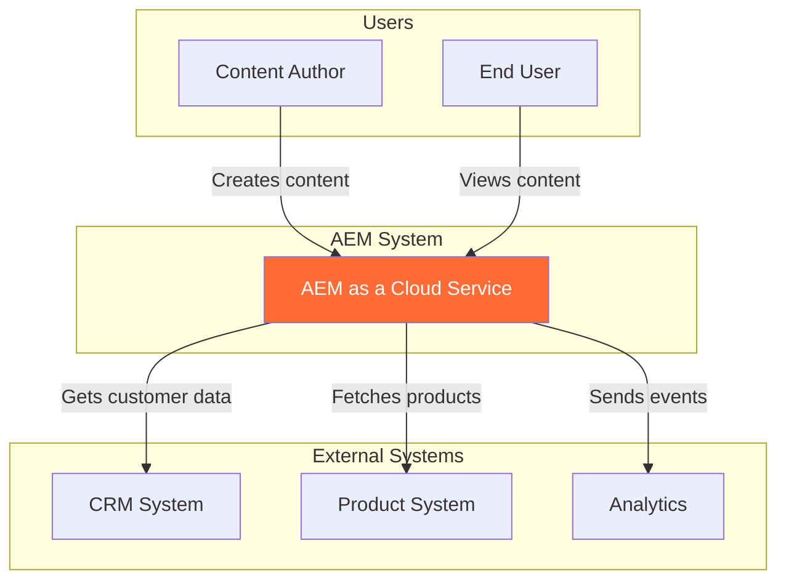

### Level 2: Container Diagram

Shows major containers within AEM ecosystem.

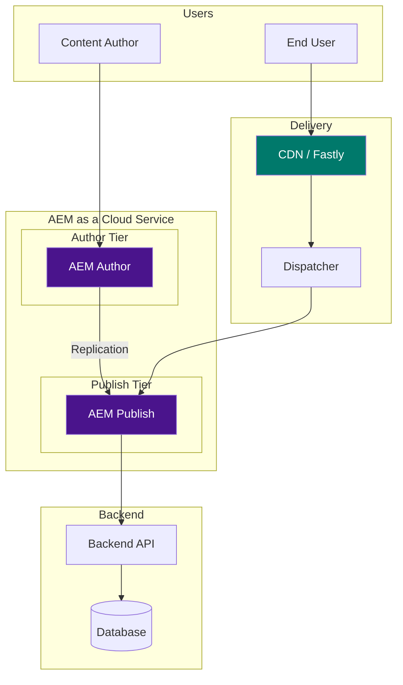

### Level 3: Component Diagram

Shows internal structure of AEM Publish.

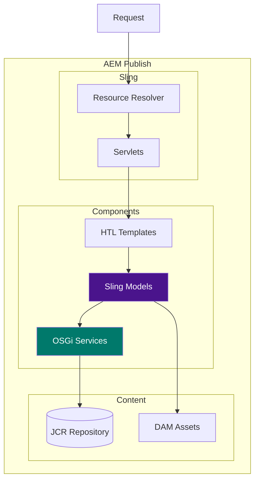

---

## Flow Diagrams

### Content Delivery Flow

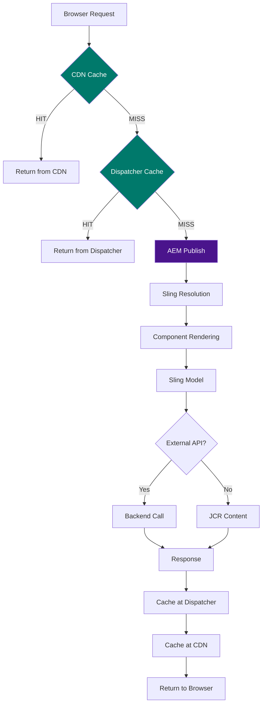

### Authoring Flow

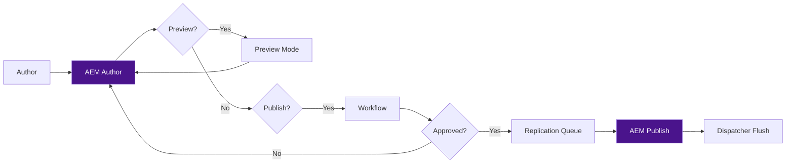

---

## Caching Diagrams

### Cache Decision Tree

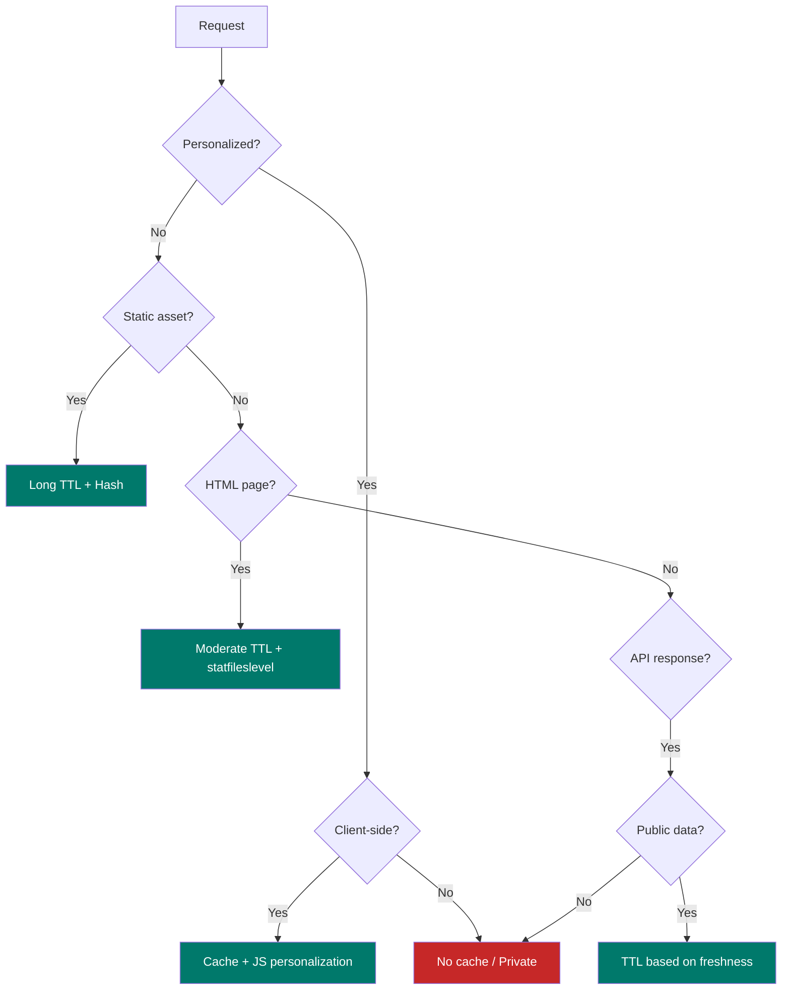

### Cache Invalidation Flow

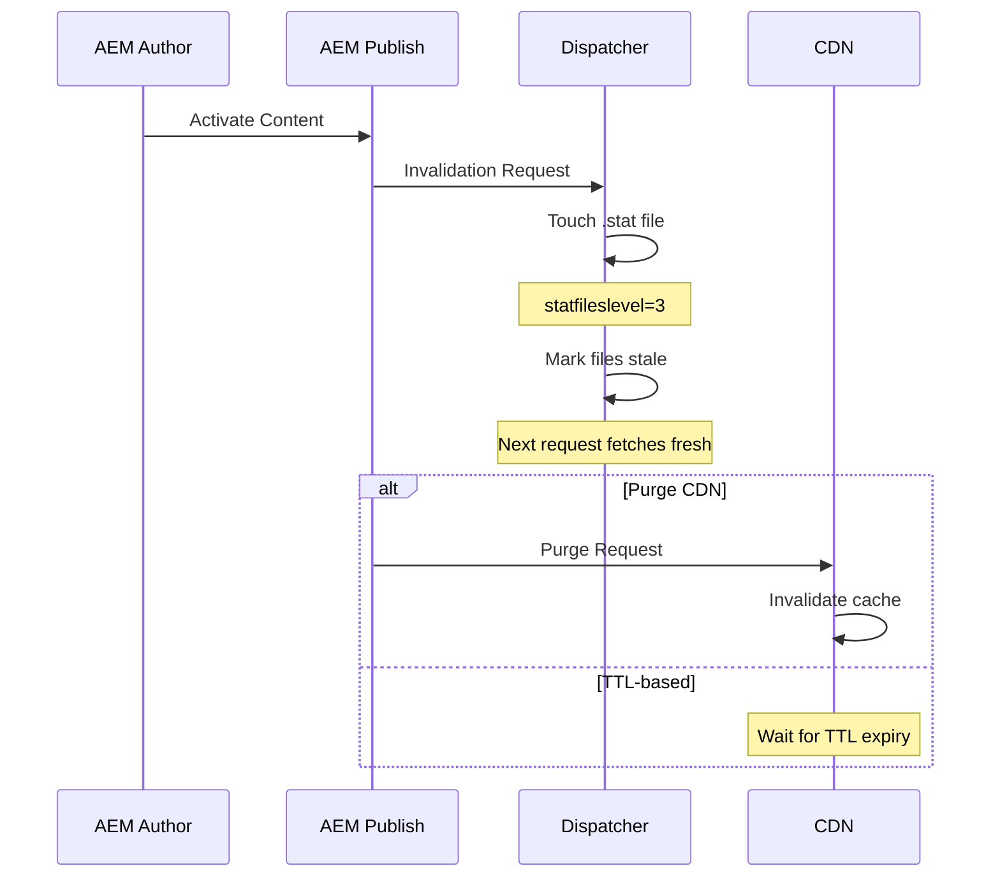

### Multi-Layer Cache

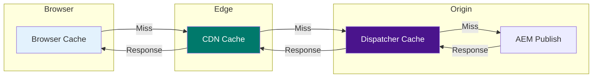

---

## Sequence Diagrams

### API Integration Pattern

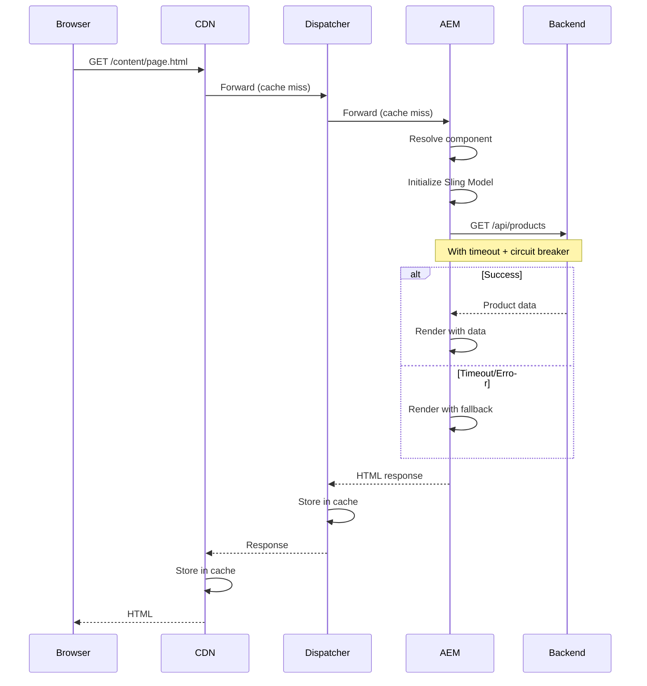

### Content Replication

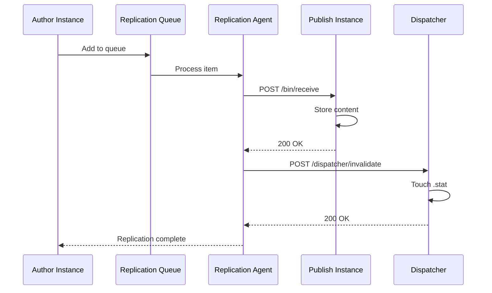

---

## State Diagrams

### Content Lifecycle

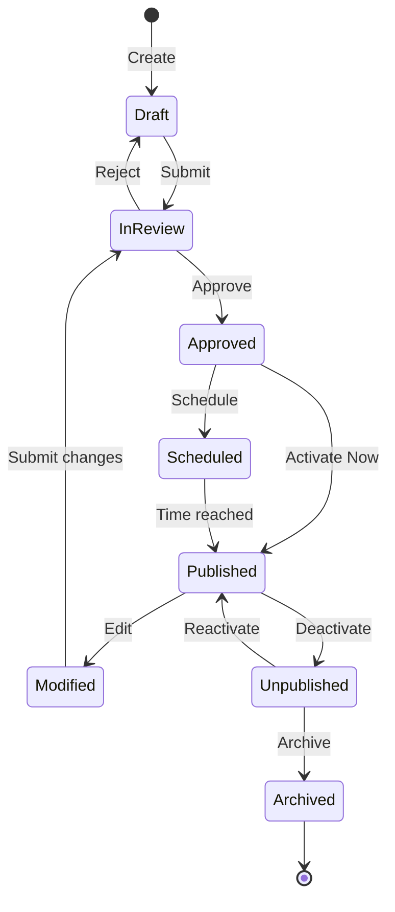

### Request State

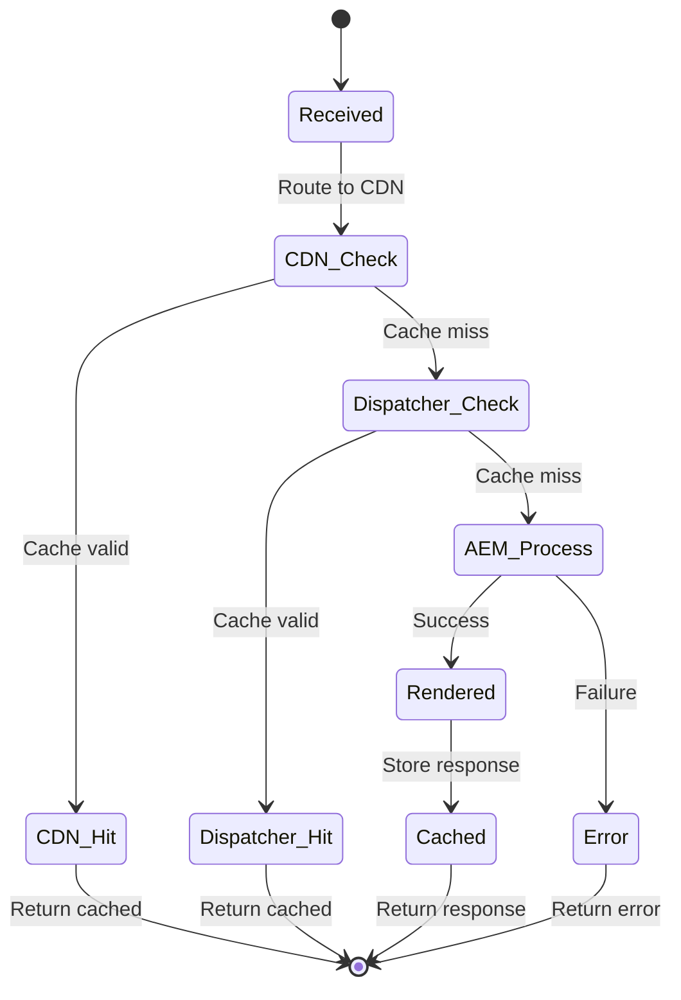

---

## ASCII Patterns

### Layer Architecture

```
┌─────────────────────────────────────────────────────────────────┐
│                         PRESENTATION                             │
│  ┌─────────────────┐  ┌─────────────────┐  ┌─────────────────┐  │
│  │  HTL Templates  │  │   ClientLibs    │  │  Author Dialog  │  │
│  └────────┬────────┘  └────────┬────────┘  └─────────────────┘  │
├───────────┼────────────────────┼────────────────────────────────┤
│           │                    │               MODEL             │
│  ┌────────▼────────────────────▼──────────────────────────────┐ │
│  │                      Sling Models                           │ │
│  │  @ValueMapValue | @OSGiService | @ChildResource            │ │
│  └────────────────────────────┬───────────────────────────────┘ │
├───────────────────────────────┼─────────────────────────────────┤
│                               │                SERVICE           │
│  ┌────────────────────────────▼───────────────────────────────┐ │
│  │                      OSGi Services                          │ │
│  │  Business Logic | External APIs | Caching                  │ │
│  └────────────────────────────┬───────────────────────────────┘ │
├───────────────────────────────┼─────────────────────────────────┤
│                               │              REPOSITORY          │
│  ┌────────────────────────────▼───────────────────────────────┐ │
│  │                     JCR Repository                          │ │
│  │  Pages | Content Fragments | Assets                         │ │
│  └────────────────────────────────────────────────────────────┘ │
└─────────────────────────────────────────────────────────────────┘
```

### Request Flow (Simple)

```
┌─────────┐     ┌─────────┐     ┌────────────┐     ┌─────────────┐
│ Browser │ ──▶ │   CDN   │ ──▶ │ Dispatcher │ ──▶ │ AEM Publish │
└─────────┘     └────┬────┘     └─────┬──────┘     └──────┬──────┘
                     │                │                    │
                     │ Cache?         │ Cache?             │
                     │   │            │   │                │
                     │   ▼            │   ▼                ▼
                     │ ┌───┐          │ ┌───┐          ┌───────┐
                     │ │HIT│──────────┼─│HIT│──────────│Render │
                     │ └───┘          │ └───┘          └───────┘
                     │                │                    │
                     ◀────────────────┴────────────────────┘
                              Response
```

### Boundary Diagram

```
╔═══════════════════════════════════════════════════════════════════╗
║                           AEM BOUNDARY                             ║
╠═══════════════════════════════════════════════════════════════════╣
║                                                                    ║
║   ┌──────────────────────┐        ┌──────────────────────┐       ║
║   │    AUTHORING         │        │      DELIVERY        │       ║
║   │    ─────────         │        │      ────────        │       ║
║   │  • Content creation  │   ──▶  │  • Content serving   │       ║
║   │  • Preview           │        │  • JSON APIs         │       ║
║   │  • Workflows         │        │  • Asset delivery    │       ║
║   │  • Personalization   │        │                      │       ║
║   │    setup             │        │                      │       ║
║   └──────────────────────┘        └──────────────────────┘       ║
║                                                                    ║
╠═══════════════════════════════════════════════════════════════════╣
║                    OUTSIDE AEM BOUNDARY                            ║
╠═══════════════════════════════════════════════════════════════════╣
║                                                                    ║
║   ┌──────────────────────┐        ┌──────────────────────┐       ║
║   │    EDGE/CDN          │        │    BACKEND           │       ║
║   │    ────────          │        │    ───────           │       ║
║   │  • Edge caching      │        │  • Business logic    │       ║
║   │  • SSL termination   │        │  • Data processing   │       ║
║   │  • Geographic routing│        │  • Integrations      │       ║
║   │  • DDoS protection   │        │  • Personalization   │       ║
║   │                      │        │    engine            │       ║
║   └──────────────────────┘        └──────────────────────┘       ║
║                                                                    ║
╚═══════════════════════════════════════════════════════════════════╝
```

### Content Hierarchy

```
/content
└── mysite
    ├── us                          # Region
    │   ├── en                      # Language
    │   │   ├── home                # Page
    │   │   ├── products
    │   │   │   ├── category-a
    │   │   │   └── category-b
    │   │   └── about
    │   └── es                      # Spanish
    │       └── ...
    └── eu
        ├── en
        ├── de
        └── fr

/content/dam
└── mysite
    ├── shared                      # Global assets
    └── regional
        ├── us
        └── eu
```

### Cache TTL Matrix

```
┌────────────────────┬─────────────┬──────────────┬────────────────┐
│   Content Type     │   CDN TTL   │ Dispatcher   │ Invalidation   │
├────────────────────┼─────────────┼──────────────┼────────────────┤
│ HTML Pages         │   5 min     │   5 min      │ On publish     │
│ Static Assets      │   1 year    │   1 year     │ Hash-based     │
│ JSON APIs          │   1 min     │   1 min      │ On publish     │
│ Personalized       │   0 (none)  │   0 (none)   │ N/A            │
│ Experience Frags   │   5 min     │   5 min      │ On publish     │
└────────────────────┴─────────────┴──────────────┴────────────────┘
```

---

## Diagram Best Practices

1. **Use consistent colors**
   - AEM components: `#4a148c` (purple)
   - Caching layers: `#00796b` (teal)
   - Errors/warnings: `#c62828` (red)
   - Users/external: default

2. **Keep diagrams focused**
   - One concept per diagram
   - 5-10 elements maximum
   - Clear flow direction

3. **Add legends when needed**
   - Explain non-obvious symbols
   - Note color meanings

4. **Match detail to audience**
   - Context: Business stakeholders
   - Container: Technical leads
   - Component: Developers
